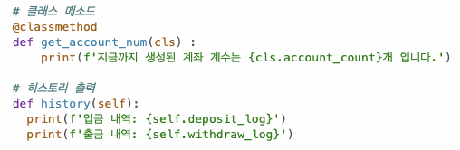
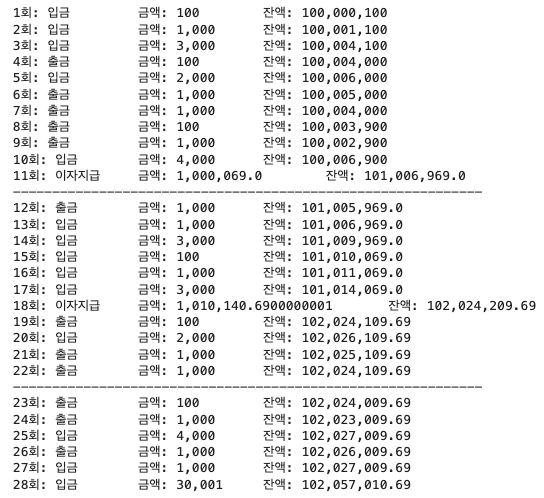

# AIFFEL Campus Online Code Peer Review Templete
- 코더 : 차병곤
- 리뷰어 : 정범준


# PRT(Peer Review Template)
- [x]  **1. 주어진 문제를 해결하는 완성된 코드가 제출되었나요?**

    클래스 변수를 @클래스메서드로 호출한 게 인상적이었습니다.
    입금, 출급, 이자지급, 히스토리 모두 완벽히 작동합니다.
    계좌번호 생성에 약간의 착오가 있었으나 바로 수정 가능한 문제입니다.
    
    
- [x]  **2. 전체 코드에서 가장 핵심적이거나 가장 복잡하고 이해하기 어려운 부분에 작성된 
주석 또는 doc string을 보고 해당 코드가 잘 이해되었나요?**

    복잡한 부분은 주석이 적은 편이지만
    발표 시간에 모두 설명해주셔서 이해에 어려움은 없었습니다.
        
- [x]  **3. 에러가 난 부분을 디버깅하여 문제를 해결한 기록을 남겼거나
새로운 시도 또는 추가 실험을 수행해봤나요?**

    히스토리 출력 부분에 세심한 신경을 쓴 게 보였습니다.
    저도 조금 더 관심을 가지고 접근해야하는 부분인데 반성하게 됐습니다.
    
        
- [ ]  **4. 회고를 잘 작성했나요?**

    코드에 회고는 없으나 발표 시간에 자세한 내용을 들을 수 있었습니다.
        
- [x]  **5. 코드가 간결하고 효율적인가요?**
      
    f스트링으로 출력 코드를 최소화 하려는 노력이 곳곳에 보입니다.
    또한 클래스 변수를 호출할 때 self가 아니라 클래스 이름으로 호출하여 직관적인 코드를 작성했습니다


# 회고(참고 링크 및 코드 개선)
```
# 리뷰어의 회고를 작성합니다.
# 코드 리뷰 시 참고한 링크가 있다면 링크와 간략한 설명을 첨부합니다.
# 코드 리뷰를 통해 개선한 코드가 있다면 코드와 간략한 설명을 첨부합니다.
```
